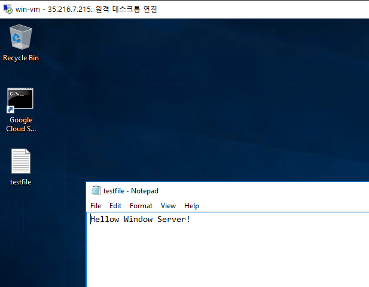

# Ansible - Window 연결

- Ansible을 통해 Window 서버와 연결하여 명령을 내릴수 있음

- Window의 경우 SSH가 아닌 winrm을 통해 연결해야 동작

- Window 서버용 별도 모듈이 있으므로 참고
    - https://docs.ansible.com/ansible/2.9/modules/list_of_windows_modules.html


## 작업 환경

- 리눅스 서버 
    - ansible master 서버
    - GCP gce (VM)
    - centos 이미지 사용

- Window 서버
    - ansible 작업 대상 서버
    - GCP gce (VM)
    - Windows Datacenter 2016 이미지 사용


### 방화벽 설정
- 3389 (RDP Port)
    - 접속해서 유저 패스워드 변경 및 winrm 서비스 상태를 확인해야함
- 5985, 5986
    - winrm은 해당 포트를 통해 http/https방식으로 통신

## 작업순서
1. GCP 방화벽 오픈
2. ansible python 버전 업데이트 (2.7 > 3.8 이상)
3. openssl 업데이트 ( 1.1.1+ 이상 )
4. Window Server - Winrm 확인 및 사용자 패스워드 변경
5. Ansible host 파일에 Window 서버 추가
6. win_ping 모듈로 연결확인
7. win_copy 모듈로 파일 복사 해보기


### 기존 설치된 ansible 삭제
```
yum remove ansible
```
### python3 설치 (3.8 이상)

- python3 설치 (3.6)
```
yum install -y python3 
```

- python3 버전 업그레이드 (3.8)
    - 안하면 에러메세지 계속뜸..

```
yum install gcc openssl-devel bzip2-devel libffi-devel -y
wget https://www.python.org/ftp/python/3.8.11/Python-3.8.11.tgz
tar -zxvf Python-3.8.11.tgz
cd Python-3.8.11
./configure --enable-optimizations
make altinstall
```

- python 버전별 Path 확인
```
$ which python3
/usr/bin/python3.6

$ which python3.8
/usr/local/bin/python3.8
```
- python3 버전 변경을 위해 update-alternatives 등록 
```
update-alternatives --install /usr/bin/python3 python3 /usr/bin/python3.6 1
update-alternatives --install /usr/bin/python3 python3 /usr/local/bin/python3.8 2
```


- python3 버전 변경
```
$ update-alternatives --config python3

There are 2 programs which provide 'python3'.

  Selection    Command
-----------------------------------------------
   1           /usr/bin/python3.6
*+ 2           /usr/local/bin/python3.8

Enter to keep the current selection[+], or type selection number: 2
```

- pip3 업그레이드
```
python3 -m pip install --upgrade pip
```

- ansible 재설치 
```
pip3 install ansible
```

- ansible 버전 확인

```
$ ansible --version
ansible [core 2.13.13]
  config file = /etc/ansible/ansible.cfg
  configured module search path = ['/root/.ansible/plugins/modules', '/usr/share/ansible/plugins/modules']
  ansible python module location = /usr/local/lib/python3.8/site-packages/ansible
  ansible collection location = /root/.ansible/collections:/usr/share/ansible/collections
  executable location = /usr/local/bin/ansible
  python version = 3.8.11 (default, Feb  6 2024, 16:03:46) [GCC 4.8.5 20150623 (Red Hat 4.8.5-44)]
  jinja version = 3.1.3
  libyaml = True
```


- python3 winrm 모듈 설치
```
pip3 install "pywinrm>=0.3.0" 
```

## openssl 업데이트 필요 (1.1.1+ 이상)

- 현재 버전 확인
```
$rpm -qa | grep openssl
openssl-1.0.2k-26.el7_9.x86_64
openssl-libs-1.0.2k-26.el7_9.x86_64
openssl-devel-1.0.2k-26.el7_9.x86_64

$ openssl version
OpenSSL 1.0.2k-fips  26 Jan 2017
```

- 기존 openssl 삭제
```
yum remove openssl

```bash
# 설치에 필요한 패키지 설치 
yum install gcc gcc-c++ pcre-devel zlib-devel perl wget

cd /usr/local/src   # 컴파일 할 소스 위치
wget https://www.openssl.org/source/openssl-1.1.1k.tar.gz
tar xvfz openssl-1.1.1k.tar.gz

# 컴파일 
cd openssl-1.1.1k
./config --prefix=/usr/local/ssl --openssldir=/usr/local/ssl shared zlib
make & make install
```


- /etc/ld.so.conf.d/openssl-1.1.1g.conf 파일 생성 후 다음 내용 입력
>vi /etc/ld.so.conf.d/openssl-1.1.1g.conf
```
/usr/local/ssl/lib
```

- 심볼릭 링크 설정
```
ln -s /usr/local/ssl/lib/libssl.so.1.1 /usr/lib64/libssl.so.1.1
ln -s /usr/local/ssl/lib/libcrypto.so.1.1 /usr/lib64/libcrypto.so.1.1
ln -s /usr/local/ssl/bin/openssl /bin/openssl
```

- openssl 버전 확인
```
$ openssl version
OpenSSL 1.0.2k-fips  26 Jan 2017
```


## Window Server - Winrm 확인 및 사용자 패스워드 변경

- Window Datacenter 2016 이미지에는 기본적으로 설치되어있음
    - 없는경우 따로 설치 필요

```ps1
# Winrm 서비스 확인
C:\Windows\system32> get-service -Name winrm

Status   Name               DisplayName
------   ----               -----------
Running  winrm              Windows Remote Management (WS-Manag...

# Winrm Listner 상태 확인
C:\Windows\system32> winrm enumerate winrm/config/Listener

 Listener
    Address = *
    Transport = HTTP
    Port = 5985
    Hostname
    Enabled = true
    URLPrefix = wsman
    CertificateThumbprint
    ListeningOn = 127.0.0.1, 192.168.1.10, ::1, 2001:0:2851:782c:1851:28be:3f57:fef5, fe80::5efe:192.168.1.10%7, fe80::1
851:28be:3f57:fef5%8, fe80::3118:cca:c9a4:5d8%2

Listener
    Address = *
    Transport = HTTPS
    Port = 5986
    Hostname
    Enabled = true
    URLPrefix = wsman
    CertificateThumbprint = 4B42446EDEE4A5AD0509B53E0C409675CD4CF186
    ListeningOn = 127.0.0.1, 192.168.1.10, ::1, 2001:0:2851:782c:1851:28be:3f57:fef5, fe80::5efe:192.168.1.10%7, fe80::1
851:28be:3f57:fef5%8, fe80::3118:cca:c9a4:5d8%2
```

### winrm 활성화 방법

- winrm 활성화 (http만)
    - https 연결시 별도의 인증서 필요
    - 현재는 http만 사용하여 ansible을 연결하므로 http만 활성화
```powershell
WinRM quickconfig
```

- winrm https 활성화 방법
    - self-signed 인증서 생성하여 진행

- self-signed 인증서 생성    
```
> New-SelfSignedCertificate -CertstoreLocation Cert:\LocalMachine\My -DnsName $env:COMPUTERNAME

Thumbprint                                Subject
----------                                -------
xxxxxx                                    CN=xxxxxx
```
- HTTPS 리스너 생성
    - <hostname> : 'CN=' 뒤의 Hostname 입력
    - <thumbprint> : 인증서의 thumbprint 값 입력
```
> winrm create winrm/config/Listener?Address=*+Transport=HTTPS '@{Hostname="<hostname>"; CertificateThumbprint="<thumbprint>"}'
```

- 리스너 삭제 시
```
 winrm delete winrm/config/Listener?Address=*+Transport=HTTPS
```


- Window 서버 접속 계정 password 변경 권장
    - 추후 hosts 추가 시 편의를 위함


## Ansible host 파일에 Window 서버 추가
- /etc/ansible/hosts 에 윈도우서버 추가
- Window 서버의 경우 Host파일이나 playbook 등에 설정

```
[win]
192.168.1.10

[win:vars]
ansible_user=wocheon07
ansible_password=********                   #window 서버 RDP 접속 후 
ansible_connection=winrm                    #winrm모듈로 통신
ansible_winrm_transport=ntlm                #HTTP로 통신하도록 변경
ansible_winrm_server_cert_validation=ignore #SSL인증서 확인하지 않도록 변경
```

## win_ping 모듈로 연결 확인
- Window 서버는 리눅스 서버와 다른 별개의 모듈을 사용
    - ex) ping > win_ping

- win_ping 모듈로 연결확인
    - urllib3 모듈 관련 오류 발생
```
ansible win -m win_ping
192.168.1.10 | FAILED! => {
    "msg": "winrm or requests is not installed: urllib3 v2 only supports OpenSSL 1.1.1+, currently the 'ssl' module is compiled with 'OpenSSL 1.0.2k-fips  26 Jan 2017'. See: https://github.com/urllib3/urllib3/issues/2168"
}
```

- urllib3 모듈 삭제 후 재 설치
```
pip uninstall urllib3
pip install 'urllib3<2.0'
```

- 다시 연결 확인
```
ansible win -m win_ping
192.168.1.10 | SUCCESS => {
    "changed": false,
    "ping": "pong"
}
```


## win_copy 모듈로 파일 복사
- win_copy 모듈은 기존 copy모듈과 동일하게 사용가능
    - dest 작성시 '/' 와 '\' 잘 구분하여 사용할것 

- 복사할 테스트용 파일 생성
```
echo 'Hellow Window Server!' > testfile.txt
```

- playbook 작성

> vi win_cp.yml
```
- name: ansible win cp test
  hosts: win
  gather_facts: false

  tasks:
  - name: copy file - linux to windows
    win_copy:
      src: "{{ playbook_dir }}/testfile.txt"
      dest: C:\Users\wocheon07\Desktop\testfile.txt
```

- playbook 실행 결과
```
$ ansible-playbook win_cp.yml

PLAY [ansible win cp test] *************************************************************************************

TASK [copy file - linux to windows] ****************************************************************************
changed: [192.168.1.10]

PLAY RECAP *****************************************************************************************************
192.168.1.10               : ok=1    changed=1    unreachable=0    failed=0    skipped=0    rescued=0    ignored=0
```

- 결과 확인




## 참고 - Window 서버에서 리눅스로 파일 가져오기
- 위와 반대의 경우 기본 fetch모듈을 통해 가져옴
    - 작업 대상 서버가 많은 경우 추가로 구분자를 설정해줘야 파일이 겹치지 않으므로 주의
```
- name: ansible win fetch test
  hosts: win
  gather_facts: false

  tasks:
  - name: copy file - windows to linux
    fetch:
      src: 'C:\Users\wocheon07\Desktop\testfile.txt'
      dest: "{{ playbook_dir }}/testfile.txt"
      flat: yes

```