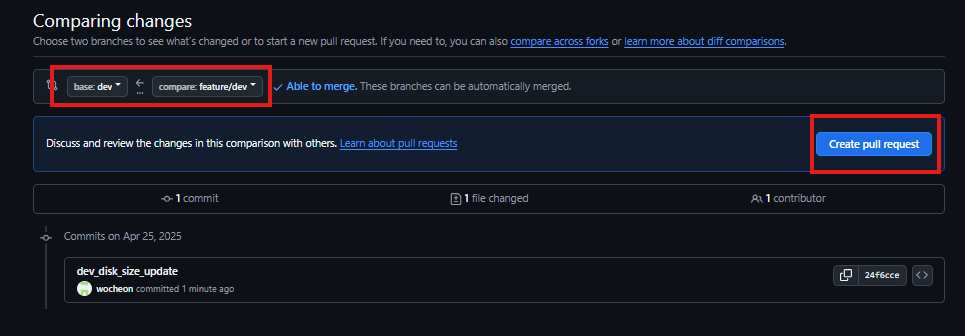

# Terraform - Atlantis 연동

## Atlantis ?
- Terraform 작업을 자동화하고 협업을 개선하기 위한 오픈소스 툴
- GitOps 방식으로 Terraform을 운영 가능하며, PR(Pull Request) 기반으로 인프라 변경을 안전하게 관리
- github, gitlab을 모두 지원 

## Atlantis 설치 

### Atlantis Workspace 용 Github Repository 생성 

- GitHub 계정 Personal Access Token(PAT) 생성
  - 프로필 > Settings > Developer Settings > Personal access tokens (classic) 
    - 권한 : repo , admin:repo_hook

- Atlantis Workspace 용 Github Repository
    - github repository 명 : atlantis_terraform_repo
    - 권한 : Public 


### Atlantis Workspace 용 디렉토리 생성 

```
# 디렉토리 생성
mkdir -p /root/atlantis/workspace/terraform

# Git Clone 혹은 git remote add로 원격 저장소 추가
cd /root/atlantis/workspace
git clone https://github.com/wocheon/atlantis_terraform_repo.git .

```

### GitHub repository Webhook 설정 
    - Atlantis Workspace 용 Github Repository에 `서버_IP/events` 주소에 대해 Webhook 설정
    - Webhooks 설정 
        - Payload URL : `http://[Atlantis_서버 주소]:4141/events`
        - Content type : application/x-www-form-urlencoded
        - Trigger 설정 
            - Pushes (Defualt)
            
            
            - Pull requests
            - Pull request reviews
            - Pull request review comments

            - Issue
            - Issue comments


### docker를 통해 Atlantis 설치
- 환경 변수를 지정하여 Atlantis Container를 실행하는 스크립트 생성
> run_atlantis_container.sh
```sh 
#!/bin/bash

# 참고.GitLab 용 환경변수 
#ATLANTIS_GITLAB_TOKEN=<your-token>
#ATLANTIS_GITLAB_USER=<your-user>
#ATLANTIS_GITLAB_HOSTNAME=gitlab.com  # self-managed GitLab이면 도메인 입력

# GitHub 용 환경변수 
ATLANTIS_CONTAINER_NAME="atlantis"
ATLANTIS_VOLUME_DIR="/root/atlantis/workspace"
ATLANTIS_GH_TOKEN="xxxxxxxxxxxxxxxxxxxxxxxxxx"
ATLANTIS_GH_USER="wocheon"

docker run -d --name $ATLANTIS_CONTAINER_NAME \
  -p 4141:4141 \
  -v $ATLANTIS_VOLUME_DIR:/repos \
  -v $(pwd)/terraformrc:/home/atlantis/.terraformrc \
  -e TF_CLI_CONFIG_FILE=/home/atlantis/.terraformrc \
  -e ATLANTIS_GH_TOKEN=$ATLANTIS_GH_TOKEN \
  -e ATLANTIS_GH_USER=$ATLANTIS_GH_USER \
  -e ATLANTIS_REPO_ALLOWLIST=github.com/wocheon/atlantis_terraform_repo \
  runatlantis/atlantis
```

## Atlantis 설정
- Atlantis 설정용 Yaml 파일 작성 
    - workspace 디렉토리 내 `.atlantis.yaml` 파일 작성
> /root/atlantis/workspace/.atlantis.yaml
```yaml
version: 3
projects:
  - name: dev
    dir: terraform
    workspace: dev
    terraform_version: v1.5.7
    autoplan:
      enabled: true
      when_modified: ["*.tf", "dev.tfvars"]
    apply_requirements: [approved]
    workflow: workflow

  - name: prd
    dir: terraform
    workspace: prd
    terraform_version: v1.5.7
    autoplan:
      enabled: true
      when_modified: ["*.tf", "prd.tfvars"]
    apply_requirements: [approved]
    workflow: workflow

workflows:
  default:
    plan:
      steps:
        - run: terraform plan -var-file=${terraform.workspace}.tfvars
    apply:
      steps:
        - run: terraform apply -var-file=${terraform.workspace}.tfvars
```

### Terraform tf 파일 구성
- tf파일의 경우 main.tf , variables.tf로 구성
- 개발/운영 환경에 대한 tfvars 파일을 별도로 생성 (dev.tfvars, prd.tfvars)

> main.tf
```tf
terraform {
#  required_version = ">= 1.5.0"

  required_providers {
    google = {
      source  = "hashicorp/google"
      version = ">= 6.29.0"
    }
  }
}

provider "google" {
  project = var.project
  region  = var.region
}

module "gce_disk" {
#  source = "../modules/gce_disk"
  source  = "app.terraform.io/terraform_cloud_wocheon/gcp-module-registry/gcp//modules/gce_disk"
  version = "1.0.4"
  new_disk_name         = var.new_disk_name
  new_disk_zone         = var.new_disk_zone
  new_disk_type         = var.new_disk_type
  new_disk_size         = var.new_disk_size
  new_disk_labels       = var.new_disk_labels
### Source Configurations ###
  new_disk_image_id              = var.new_disk_image_id
  new_disk_snapshot_id           = var.new_disk_snapshot_id  
}

output "gce_disk_id" {
  description = "Show GCE disk ID"
  value       = module.gce_disk.disk_id
}

output "gce_disk_self_link" {
  description = "Show GCE disk ID"
  value       = module.gce_disk.self_link
}
```

> variables.tf
```tf
### GCP Project&Region ###

variable "project" {
  type        = string
}

variable "region" {
  type        = string
  default     = "asia-northeast3"
}

variable "zone" {
  type        = string
  default     = "asia-northeast3-c"
}

### BOOT_DISK Configurations ###

variable "new_disk_name" {
  type        = string
}

variable "new_disk_zone" {
  type        = string
}

variable "new_disk_size" {
  type        = number
}

variable "new_disk_type" {
  type        = string
  default     = "pd-standard"
}

variable "new_disk_labels" {
  type        = map(string)
  default     = { 
        type = "gce-boot-disk"
        user = "wocheon07"   
  } 
}

### Source Configurations ###

variable "new_disk_snapshot_id" {
  type        = string
  default     = ""
}

variable "new_disk_image_id" {
  type        = string
  default     = ""
}
```

> dev.tfvars
```tf
### GCP Project&Region ###
project       = "gcp-in-ca"
region        = "asia-northeast3"
zone          = "asia-northeast3-a"

### Boot_disk Configurations ###
new_disk_name = "gce-terraform-atlantis-disk-dev"
new_disk_size = 10	#number
#new_disk_type = "pd-standard"
new_disk_type = "pd-balanced"
new_disk_zone = "asia-northeast3-a"

new_disk_labels = {
   type = "gce-boot-disk"
   user = "wocheon07"
}

### Source Configurations ###
# 둘중 Null이 아닌 값을 찾아 사용
new_disk_image_id       = null
new_disk_snapshot_id    = null
```

> prd.tfvars
```tf
### GCP Project&Region ###
project       = "gcp-in-ca"
region        = "asia-northeast3"
zone          = "asia-northeast3-a"

### Boot_disk Configurations ###
new_disk_name = "gce-terraform-atlantis-disk-prd"
new_disk_size = 10	#number
#new_disk_type = "pd-standard"
new_disk_type = "pd-balanced"
new_disk_zone = "asia-northeast3-a"

new_disk_labels = {
   type = "gce-boot-disk"
   user = "wocheon07"
}

### Source Configurations ###
# 둘중 Null이 아닌 값을 찾아 사용
new_disk_image_id       = null
new_disk_snapshot_id    = null
```


### 브랜치 생성 및 Git Repository에 Push

```sh
# Git branch 생성 
git branch dev
git branch prd


# git commit & Push
git checkout dev
git add . 
git commit -m "dev_branch"
git push origin dev

git checkout prd
git add . 
git commit -m "prd_branch"
git push origin prd
```

## 각 환경에 대한 변동사항 반영 

### dev 디스크 사이즈 변경 

- 기존 개발 환경 변경을 위한 새로운 브랜치 생성 
```sh
git checkout dev 
git branch feature/dev
git checkout feature/dev
```

- dev.tfvars 파일 내에서 disk_size를 변경 
  - 10 -> 20 

- 변경 사항 commit & push 
```
git add . 
git commit -m "dev_disk_size_update"
git push origin feature/dev
```

### Github PR (Pull Request) 생성 
- feature/dev의 내용을 dev branch로 Merge 하기 위해 PR 생성 

