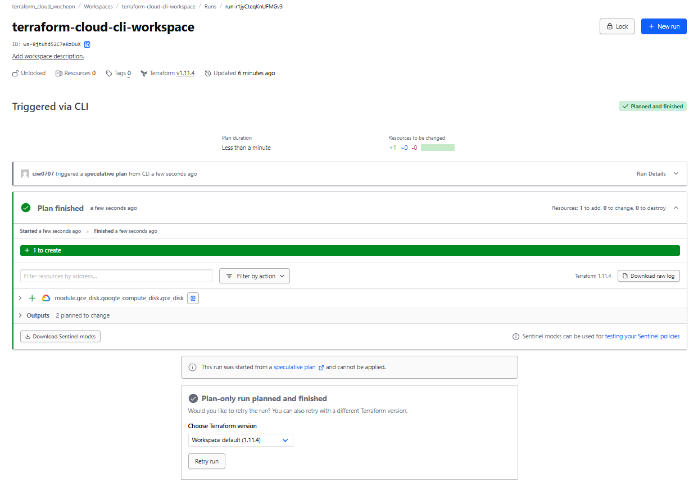
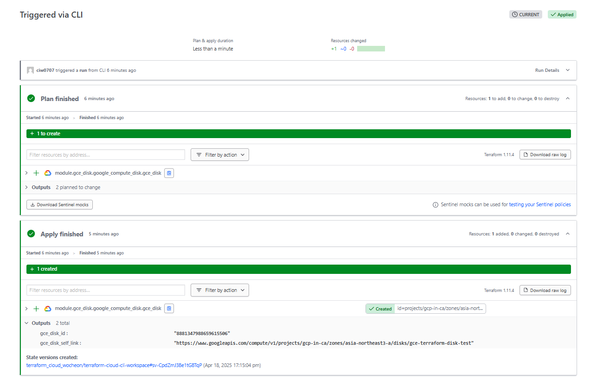
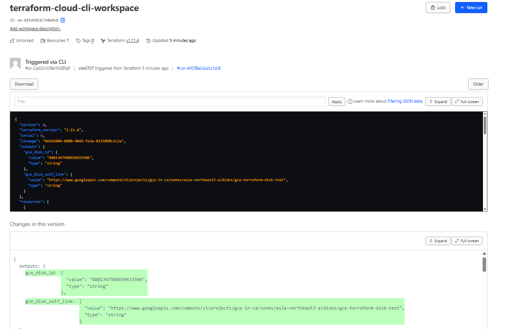
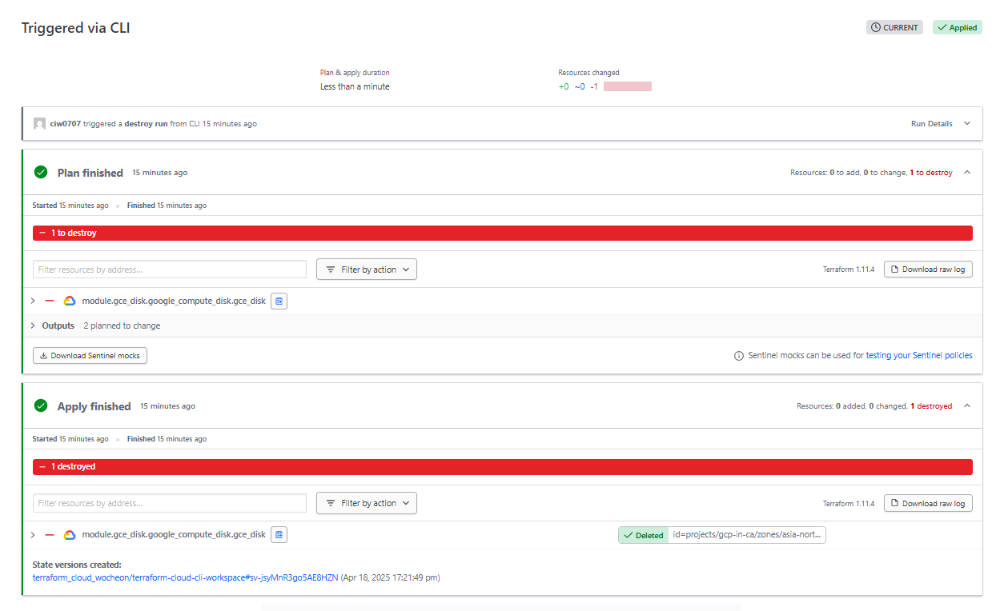
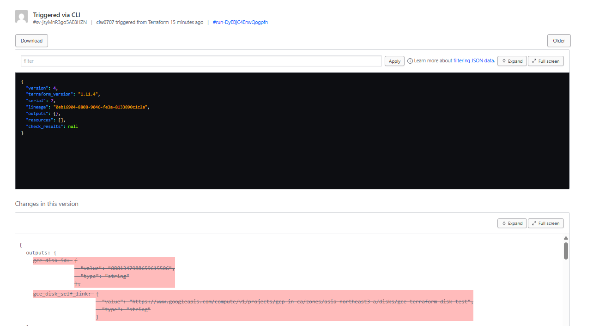

# Terraform Cloud - CLI 기반 Workspace
- 별도 VM 혹은 Cloud Shell 과 같이 Terraform CLI가 가능한 환경 필요
    - CLI를 통해 실행하더라도 동일하게 Terraform Cloud 호스팅 환경에서 Plan/Apply 실행됨

## CLI 기반 Workspace 생성 
- Project 선택 > Workspaces > Create a workspace

- CLI-Driven Workflow 선택

-  CLI 기반 Workspace 생성
    - Workspace 명: terraform-cloud-cli-workspace
    - 실행모드 : 기본값(remote)

## Terraform Cloud - Terrafom CLI 간 연동

- 사용 전 `terrafrom login`을 통해 API 토큰을 통한 Terraform Cloud 연동 필요

- tf 파일내 Terraform Cloud Workspace 정보를 명시 필요

> main.tf
```JSON
terraform {
  # Terraform Cloud Workspace
  cloud { 
    organization = "terraform_cloud_wocheon" 
    workspaces { 
      name = "terraform-cloud-cli-workspace" 
    } 
  } 
  required_version = ">= 1.5.0"
  required_providers {
    google = {
      source  = "hashicorp/google"
      version = ">= 6.29.0"
    }
  }
}
```

- terrafrom init으로 리소스 초기화 
```sh
$ terraform init
Initializing HCP Terraform...
Initializing modules...
Downloading app.terraform.io/terraform_cloud_wocheon/module-registry/gcp 1.0.0 for gce_disk...
- gce_disk in .terraform/modules/gce_disk/modules/gce_disk
Initializing provider plugins...
- Finding hashicorp/google versions matching ">= 6.29.0"...
- Installing hashicorp/google v6.30.0...
- Installed hashicorp/google v6.30.0 (signed by HashiCorp)
Terraform has created a lock file .terraform.lock.hcl to record the provider
selections it made above. Include this file in your version control repository
so that Terraform can guarantee to make the same selections by default when
you run "terraform init" in the future.

HCP Terraform has been successfully initialized!

You may now begin working with HCP Terraform. Try running "terraform plan" to
see any changes that are required for your infrastructure.

If you ever set or change modules or Terraform Settings, run "terraform init"
again to reinitialize your working directory.
```

## CLI 기반 Workspace의 Plan/Apply/Destroy
- 실행모드 Remote에서의 Plan / Apply / Destory 실행 결과

### CLI Plan 실행 
- CLI Plan 결과
  - remote로 실행하지만 CLI에서도 Plan 결과 확인가능
    ```sh
    $ terraform plan
    Running plan in HCP Terraform. Output will stream here. Pressing Ctrl-C
    will stop streaming the logs, but will not stop the plan running remotely.

    Preparing the remote plan...

    To view this run in a browser, visit:
    https://app.terraform.io/app/terraform_cloud_wocheon/terraform-cloud-cli-workspace/runs/run-r1jyCteqKnUFMGv3

    Waiting for the plan to start...

    Terraform v1.11.4
    on linux_amd64
    Initializing plugins and modules...

    Terraform used the selected providers to generate the following execution plan. Resource actions are indicated with the following symbols:
      + create

    Terraform will perform the following actions:

      # module.gce_disk.google_compute_disk.gce_disk will be created
      + resource "google_compute_disk" "gce_disk" {
          + access_mode                    = (known after apply)
          + create_snapshot_before_destroy = false
          + creation_timestamp             = (known after apply)
          + disk_id                        = (known after apply)
          + effective_labels               = {
              + "goog-terraform-provisioned" = "true"
              + "type"                       = "gce-boot-disk"
              + "user"                       = "wocheon07"
            }
          + enable_confidential_compute    = (known after apply)
          + id                             = (known after apply)
          + label_fingerprint              = (known after apply)
          + labels                         = {
              + "type" = "gce-boot-disk"
              + "user" = "wocheon07"
            }
          + last_attach_timestamp          = (known after apply)
          + last_detach_timestamp          = (known after apply)
          + licenses                       = (known after apply)
          + name                           = "gce-terraform-disk-test"
          + physical_block_size_bytes      = (known after apply)
          + project                        = "gcp-in-ca"
          + provisioned_iops               = (known after apply)
          + provisioned_throughput         = (known after apply)
          + self_link                      = (known after apply)
          + size                           = 20
          + source_disk_id                 = (known after apply)
          + source_image_id                = (known after apply)
          + source_instant_snapshot_id     = (known after apply)
          + source_snapshot_id             = (known after apply)
          + terraform_labels               = {
              + "goog-terraform-provisioned" = "true"
              + "type"                       = "gce-boot-disk"
              + "user"                       = "wocheon07"
            }
          + type                           = "pd-balanced"
          + users                          = (known after apply)
          + zone                           = "asia-northeast3-a"

          + guest_os_features (known after apply)
        }

    Plan: 1 to add, 0 to change, 0 to destroy.

    Changes to Outputs:
      + gce_disk_id        = (known after apply)
      + gce_disk_self_link = (known after apply)

    ────────────────────────────────────────────────────────────────────────────────────────────────────────────────────────────────────────────────────────────────────────────────────────────────────────────────────────────

    Note: You didn't use the -out option to save this plan, so Terraform can't guarantee to take exactly these actions if you run "terraform apply" now.
    ```
- Workspace의 run에 Plan 결과 자동 추가 
    


### CLI Apply 실행 
- Apply 실행시에도 동일하게 CLI에서도 실행 결과 출력    

    ```sh   
    $ terraform apply --auto-approve    
    Running apply in HCP Terraform. Output will stream here. Pressing Ctr   l-C
    will cancel the remote apply if it's still pending. If the apply star   ted it
    will stop streaming the logs, but will not stop the apply running rem   otely.

    Preparing the remote apply...   

    To view this run in a browser, visit:   
    https://app.terraform.io/app/terraform_cloud_wocheon/terraform-cloud-   cli-workspace/runs/run-AYCfBeLGxzLx1dJE

    Waiting for the plan to start...    

    Terraform v1.11.4   
    on linux_amd64    
    Initializing plugins and modules...   

    Terraform used the selected providers to generate the following execu   tion plan. Resource actions are indicated with the following symbols:
      + create    

    Terraform will perform the following actions:   

      # module.gce_disk.google_compute_disk.gce_disk will be created    
      + resource "google_compute_disk" "gce_disk" {   
          + access_mode                    = (known after apply)    
          + create_snapshot_before_destroy = false    
          + creation_timestamp             = (known after apply)    
          + disk_id                        = (known after apply)    
          + effective_labels               = {    
              + "goog-terraform-provisioned" = "true"   
              + "type"                       = "gce-boot-disk"    
              + "user"                       = "wocheon07"    
            }   
          + enable_confidential_compute    = (known after apply)    
          + id                             = (known after apply)    
          + label_fingerprint              = (known after apply)    
          + labels                         = {    
              + "type" = "gce-boot-disk"    
              + "user" = "wocheon07"    
            }   
          + last_attach_timestamp          = (known after apply)    
          + last_detach_timestamp          = (known after apply)    
          + licenses                       = (known after apply)    
          + name                           = "gce-terraform-disk-test"    
          + physical_block_size_bytes      = (known after apply)    
          + project                        = "gcp-in-ca"    
          + provisioned_iops               = (known after apply)    
          + provisioned_throughput         = (known after apply)    
          + self_link                      = (known after apply)    
          + size                           = 20   
          + source_disk_id                 = (known after apply)    
          + source_image_id                = (known after apply)    
          + source_instant_snapshot_id     = (known after apply)    
          + source_snapshot_id             = (known after apply)    
          + terraform_labels               = {    
              + "goog-terraform-provisioned" = "true"   
              + "type"                       = "gce-boot-disk"    
              + "user"                       = "wocheon07"    
            }   
          + type                           = "pd-balanced"    
          + users                          = (known after apply)    
          + zone                           = "asia-northeast3-a"    

          + guest_os_features (known after apply)   
        }   

    Plan: 1 to add, 0 to change, 0 to destroy.    

    Changes to Outputs:   
      + gce_disk_id        = (known after apply)    
      + gce_disk_self_link = (known after apply)    

    module.gce_disk.google_compute_disk.gce_disk: Creating...   
    module.gce_disk.google_compute_disk.gce_disk: Still creating... [10s    elapsed]
    module.gce_disk.google_compute_disk.gce_disk: Creation complete after    11s [id=projects/gcp-in-ca/zones/asia-northeast3-a/disks/gce-terraform-disk-test]

    Apply complete! Resources: 1 added, 0 changed, 0 destroyed.   

    Outputs:    
    gce_disk_id = "8881347988659615506"   
    gce_disk_self_link = "https://www.googleapis.com/compute/v1/projects/   gcp-in-ca/zones/asia-northeast3-a/disks/gce-terraform-disk-test"
    ```

- Workspace의 run에 Apply Run 자동 추가 
    

- Workspace의 State 에서 확인 가능 
    


### Destroy
- Destroy 결과는 CLI에서도 실행 결과 출력   
```sh
$ terraform destroy --auto-approve
Running apply in HCP Terraform. Output will stream here. Pressing Ctrl-C
will cancel the remote apply if it's still pending. If the apply started it
will stop streaming the logs, but will not stop the apply running remotely.

Preparing the remote apply...

To view this run in a browser, visit:
https://app.terraform.io/app/terraform_cloud_wocheon/terraform-cloud-cli-workspace/runs/run-DyEBjC4EnwQogpfn

Waiting for the plan to start...

Terraform v1.11.4
on linux_amd64
Initializing plugins and modules...
module.gce_disk.google_compute_disk.gce_disk: Refreshing state... [id=projects/gcp-in-ca/zones/asia-northeast3-a/disks/gce-terraform-disk-test]

Terraform used the selected providers to generate the following execution plan. Resource actions are indicated with the following symbols:
  - destroy

Terraform will perform the following actions:

  # module.gce_disk.google_compute_disk.gce_disk will be destroyed
  - resource "google_compute_disk" "gce_disk" {
      - create_snapshot_before_destroy = false -> null
      - creation_timestamp             = "2025-04-18T01:14:53.464-07:00" -> null
      - disk_id                        = "8881347988659615506" -> null
      - effective_labels               = {
          - "goog-terraform-provisioned" = "true"
          - "type"                       = "gce-boot-disk"
          - "user"                       = "wocheon07"
        } -> null
      - enable_confidential_compute    = false -> null
      - id                             = "projects/gcp-in-ca/zones/asia-northeast3-a/disks/gce-terraform-disk-test" -> null
      - label_fingerprint              = "YfhV4VsbiLs=" -> null
      - labels                         = {
          - "type" = "gce-boot-disk"
          - "user" = "wocheon07"
        } -> null
      - licenses                       = [] -> null
      - name                           = "gce-terraform-disk-test" -> null
      - physical_block_size_bytes      = 4096 -> null
      - project                        = "gcp-in-ca" -> null
      - provisioned_iops               = 0 -> null
      - provisioned_throughput         = 0 -> null
      - self_link                      = "https://www.googleapis.com/compute/v1/projects/gcp-in-ca/zones/asia-northeast3-a/disks/gce-terraform-disk-test" -> null
      - size                           = 20 -> null
      - terraform_labels               = {
          - "goog-terraform-provisioned" = "true"
          - "type"                       = "gce-boot-disk"
          - "user"                       = "wocheon07"
        } -> null
      - type                           = "pd-balanced" -> null
      - users                          = [] -> null
      - zone                           = "asia-northeast3-a" -> null
        # (13 unchanged attributes hidden)
    }

Plan: 0 to add, 0 to change, 1 to destroy.

Changes to Outputs:
  - gce_disk_id        = "8881347988659615506" -> null
  - gce_disk_self_link = "https://www.googleapis.com/compute/v1/projects/gcp-in-ca/zones/asia-northeast3-a/disks/gce-terraform-disk-test" -> null

module.gce_disk.google_compute_disk.gce_disk: Destroying... [id=projects/gcp-in-ca/zones/asia-northeast3-a/disks/gce-terraform-disk-test]
module.gce_disk.google_compute_disk.gce_disk: Destruction complete after 1s

Apply complete! Resources: 0 added, 0 changed, 1 destroyed.
```


- Workspace의 run에 Destroy Run 자동 추가 
    

- Workspace의 State 에서 Destroy 확인 가능 
    


## State Lock으로 충돌 방지 
- State Lock 활성화 후 terraform apply 실행 결과 
  - Workspace 가 Lock이 걸리므로 Lock 해제 전까지 대기 

```sh
$ terraform apply --auto-approve
Running apply in HCP Terraform. Output will stream here. Pressing Ctrl-C
will cancel the remote apply if it's still pending. If the apply started it
will stop streaming the logs, but will not stop the apply running remotely.

Preparing the remote apply...

To view this run in a browser, visit:
https://app.terraform.io/app/terraform_cloud_wocheon/terraform-cloud-cli-workspace/runs/run-S9zni3remrxoRLWE

Waiting for the manually locked workspace to be unlocked...
```


## 기존 Local backend를  Terraform Cloud로 이관
- 기존 Local에서 사용하던 리소스의 백엔드를 Terrafrom Cloud 로 지정하면 현재 State파일을 이관 가능 
```json
terraform {
  required_version = ">= 1.5.0"

  required_providers {
    google = {
      source  = "hashicorp/google"
      version = ">= 6.29.0"
    }
  }
  backend "remote" {
  #  cloud {
      organization = "terraform_cloud_wocheon"
      workspaces {
        name = "terraform-cloud-cli-workspace"
      }
   # }
  }
}
```

- 변경 후 terraform init 으로 이관 진행 
```bash
$ terraform init
Initializing the backend...
Do you want to copy existing state to the new backend?
  Pre-existing state was found while migrating the previous "local" backend to the
  newly configured "remote" backend. No existing state was found in the newly
  configured "remote" backend. Do you want to copy this state to the new "remote"
  backend? Enter "yes" to copy and "no" to start with an empty state.

  Enter a value: yes


Successfully configured the backend "remote"! Terraform will automatically
use this backend unless the backend configuration changes.
Initializing modules...
Initializing provider plugins...
- Reusing previous version of hashicorp/google from the dependency lock file
- Using previously-installed hashicorp/google v6.30.0

Terraform has been successfully initialized!

You may now begin working with Terraform. Try running "terraform plan" to see
any changes that are required for your infrastructure. All Terraform commands
should now work.

If you ever set or change modules or backend configuration for Terraform,
rerun this command to reinitialize your working directory. If you forget, other
commands will detect it and remind you to do so if necessary.
```

- 반대로 Terraform Cloud 의 State를 Local로 이관도 가능 
  - Backend 지정 구문 삭제 후 terraform init으로 초기화