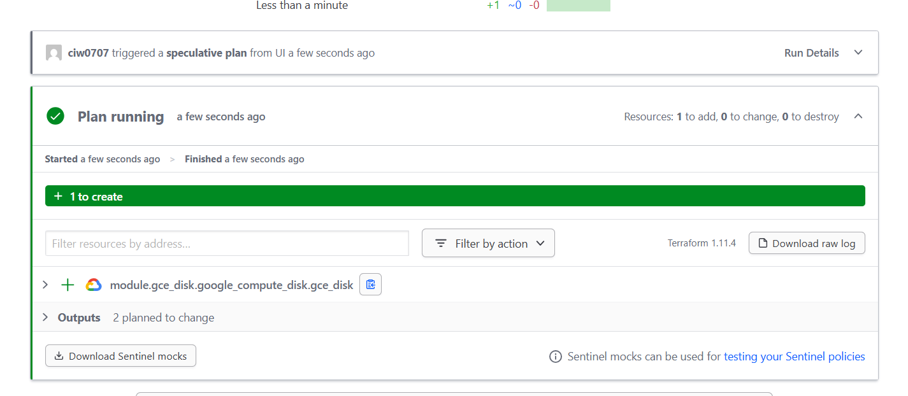
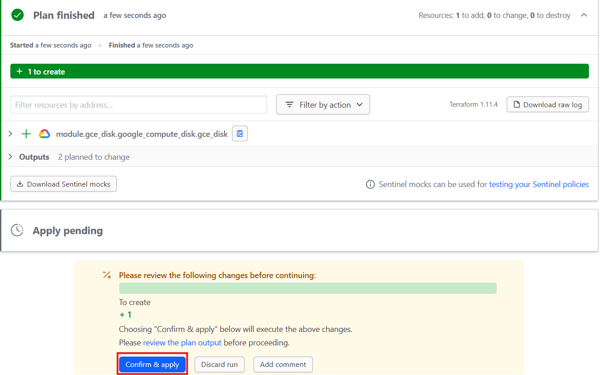
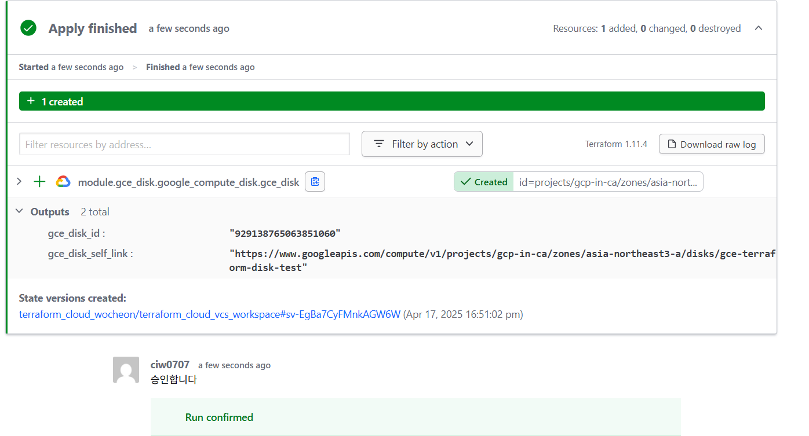
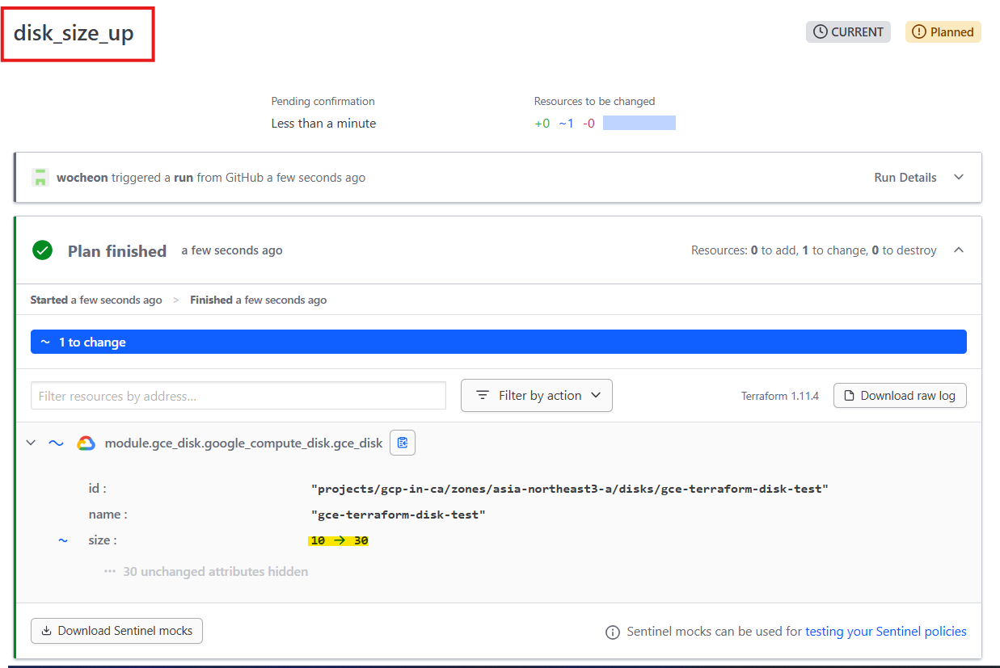
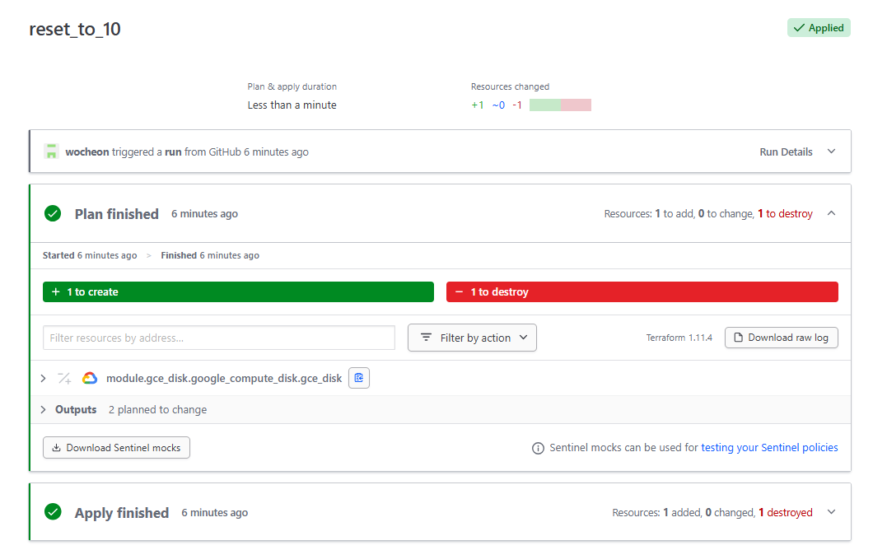
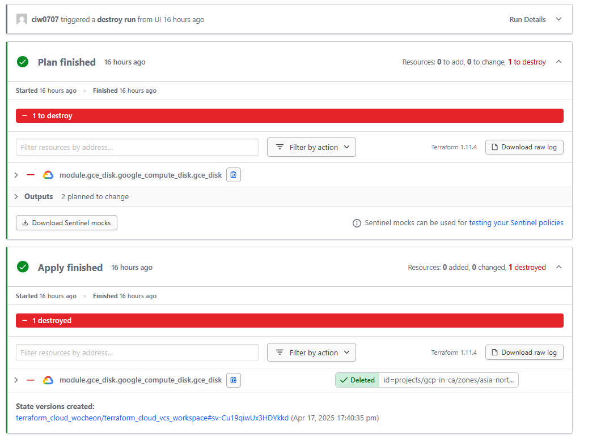
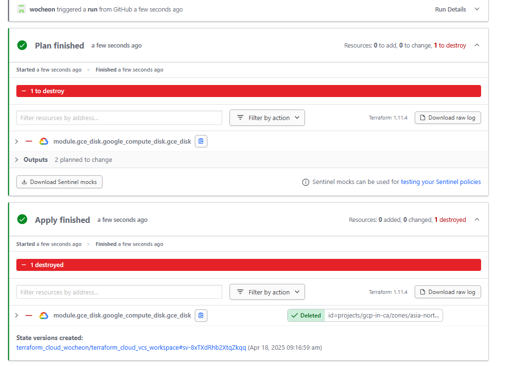

# Terraform Cloud - VCS 기반 Workspace

- VCS(Version Contril System)를 사용하는 Workspace를 생성하고 리소스 배포 및 수정 
- Git 등과 같은 버전 관리 저장소와의 연동을 통해 리소스 버전 관리 가능
- Terraform CLI를 수행하는 별도의 VM 등이 없더라도 Terraform 리소스를 배포 및 변경 가능 
- Push Trigger를 통해 변경사항을 자동으로 적용 가능 

## Workspace 연동을 위한 github repository 생성
- VCS기반 Terraform Workspace의 경우,  Terraform 코드가 포함된 Repository 필요

- Repository 구성 조건 
    - main.tf, variables.tf, outputs.tf 등의 Terraform 구성 파일이 포함되어 있어야 함
    - 기본 브랜치(main 또는 master)를 기준으로 Terraform Workspace가 구성됨
    - Terraform Cloud에서 GitHub Provider 연동을 통해 해당 Repository를 인증 및 연결 필요 

- Github Repository 구성 
    - Repository 명 : terraform-cloud-workspace-gcp-repo
    
    - Repository 파일 구성
    ```sh    
    📦terraform-cloud-workspace-gcp-repo
    ┣ 📜main.tf         
    ┣ 📜terraform.tfvars
    ┗ 📜variables.tf
    ```

    - tf파일 구성 
        - Terraform Registry내의 모듈을 로드하여 GCP Compute Disk 배포 수행
        - 변수는 terraform.tfvars파일에서 별도 지정 

        > main.tf
        ```json
        terraform {
          required_version = ">= 1.5.0"

          required_providers {
            google = {
              source  = "hashicorp/google"
              version = ">= 6.29.0"
            }
          }
        }

        provider "google" {
          project = var.project
          region  = var.region
        }

        module "gce_disk" {
        # Moudle Source는 Terraform Registry 사용
          source  = "app.terraform.io/terraform_cloud_wocheon/module-repo/google//modules/gce_disk"
          version = "1.0.0"

          new_disk_name         = var.new_disk_name
          new_disk_zone         = var.new_disk_zone
          new_disk_type         = var.new_disk_type
          new_disk_size         = var.new_disk_size
          new_disk_labels       = var.new_disk_labels        
          new_disk_image_id              = var.new_disk_image_id
          new_disk_snapshot_id           = var.new_disk_snapshot_id  
        }

        output "gce_disk_id" {
          description = "Show GCE disk ID"
          value       = module.gce_disk.disk_id
        }

        output "gce_disk_self_link" {
          description = "Show GCE disk ID"
          value       = module.gce_disk.self_link
        }
        ```

        > variables.tf
        ```json
        variable "project" { type = string }
        variable "region" { type = string, default = "asia-northeast3" }
        variable "zone" { type = string, default = "asia-northeast3-c" }
        variable "new_disk_name" { type = string }
        variable "new_disk_zone" { type = string }
        variable "new_disk_size" { type = number }
        variable "new_disk_type" { type = string, default = "pd-standard" }
        variable "new_disk_labels" { type = map(string), default = { type = "gce-boot-disk", user = "wocheon07" } }
        variable "new_disk_snapshot_id" { type = string, default = "" }
        variable "new_disk_image_id" { type = string, default = "" }
        ```

        > terraform.tfvars
        ```json
        project       = "gcp-in-ca"
        region        = "asia-northeast3"
        zone          = "asia-northeast3-a"        
        new_disk_name = "gce-terraform-disk-test"
        new_disk_size = 10	
        new_disk_type = "pd-standard"
        new_disk_zone = "asia-northeast3-a"
        new_disk_labels = { type = "gce-boot-disk", user = "wocheon07"}
        new_disk_image_id       = null
        new_disk_snapshot_id    = null
        ```

## VCS 기반 Workspace 생성
- 이전 단계에서 생성된 git repository를 workspace와 연결 
    - Workspace 명 : terraform_cloud_gcp_vcs_workspce
    - VCS Provider : github
        - 저장소 : terraform-cloud-workspace-gcp-repo

## 수동 Plan/APPLY 실행

### 수동으로 Plan 실행
- Workspace 선택 > Runs > New run 
    - Run name : Plan Test
    - Run Type : Plan Only 

- Run 결과     
    
    - Credentails 오류 발생 시 GCP SA 키 변수 등록 확인
    - `+`를 눌러 자세한 Plan 결과를 확인 가능

### 수동으로 Plan & Apply 실행
- Workspace 선택 > Runs > New run 
    - Run name : Plan&Apply
    - Run Type : Plan and apply (standard)

- Run 결과     
    - Plan        
        
        - Plan이 정상적으로 실행되면 해당 Plan에 대한 승인 여부 선택 필요
            - Confirm & Apply : 승인 및 Apply 실행                 
            - Discard run : 해당 Plan 승인을 거절하고 Apply는 취소
            - 승인/거절 내용에 대한 Comment 입력 가능

    - Apply     
        
    - Apply 완료 후 Outputs 및 
    


## Run Trigger 동작 확인

- 디스크 크기 증설을 위해 terraform.tfvars 내용 수정 후 Push
  - 기존 10GB -> 30GB
  - Commit : disk_size_up

- WorkSpace의 Run 확인 
  
  - 변경사항을 Push 하면 자동으로 해당 Commit에 대한 Plan을 실행하여 결과를 보여줌 
  - Plan 정상 실행 후 승인 하여 바로 Apply 가능 

### Run Trigger 변경 
- Run Trigger를 통해 변경사항을 바로 적용 가능하도록 설정 가능

- 변경 방법
  - Workspace Settings -> Auto-Apply 
    - `Auto-apply API, CLI, & VCS runs`
      -  Runs이 시작되면 항상 Apply를 수행 
          - ex) Push하여 생성된 Plan에 대한 run이 정상실행 되면 바로 Apply
    - `Auto-apply run triggers`
      - 다른 Workspace의 변경으로 인해 Run trigger로 현재 Workspace가 실행되면 자동으로 Apply


#### Run Trigger 변경 테스트 
  - `Auto-apply API, CLI, & VCS runs` 만 활성화 
    - 변경사항 적용 후 Push 결과 
      
      - Plan 실행 후 자동으로 Apply 까지 실행됨

  - `Auto-apply run triggers` 만 활성화 
    - 변경사항 적용 후 Push 결과 
      
      - Plan 까지만 실행 후 Pending


## State Lock으로 충돌 방지 

- State 우측 상단 Lock 을 활성화 하면 현재 state를 잠금
  - 현재 상태를 유지하면서 추가 변경사항이 적용되지않도록 설정 가능 


## Workspace 내의 State Destroy 
- 기본적으로 Workspace의 Run은 Destroy를 미지원 
  - VCS 커밋만으로 자동 destroy run을 실행 불가 

- CLI를 통해 Destory 하거나  Workspace 설정에서 Queue destroy plan을 실행해야 함
    - Workspace Settings -> Destruction and Deletion -> Queue destroy plan
  

  - Queue Destroy 실행 시 Destroy Run 실행 
    

- main.tf에서 리소스 블록를 제거하여 간접 Destroy 가능
  - Module, Output 부분을 주석처리 혹은 제외 후 Commit&Push
   
    - 리소스가 정상적으로 Destroy됨을 확인
