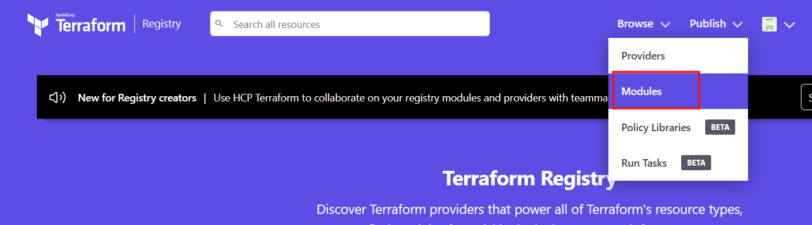
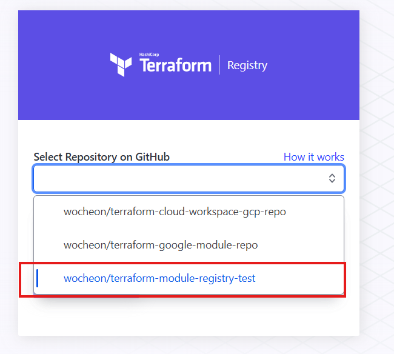
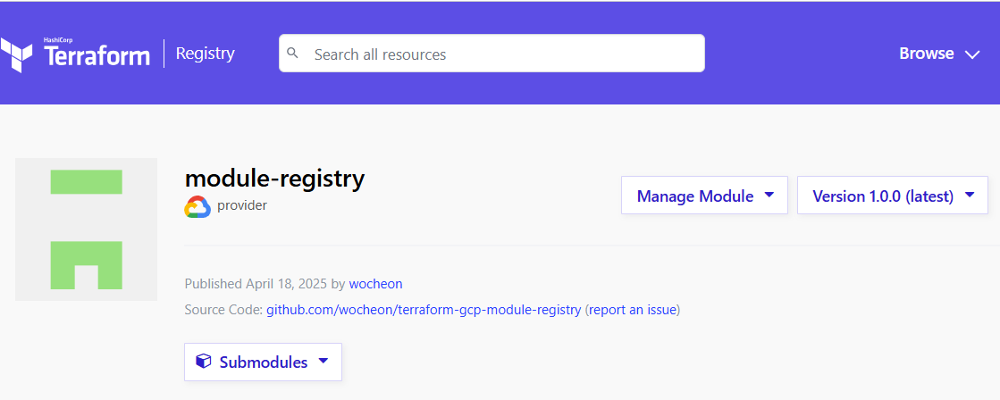
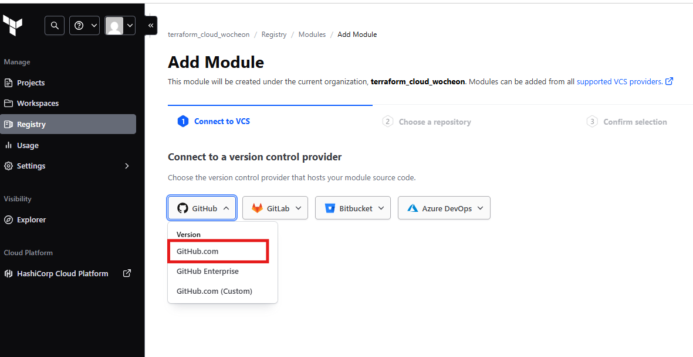
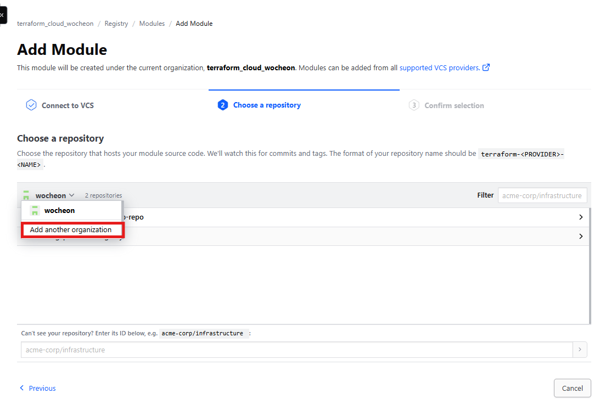
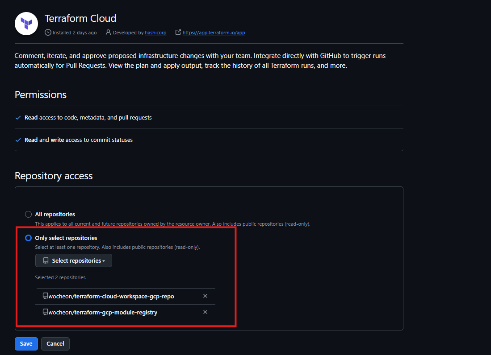
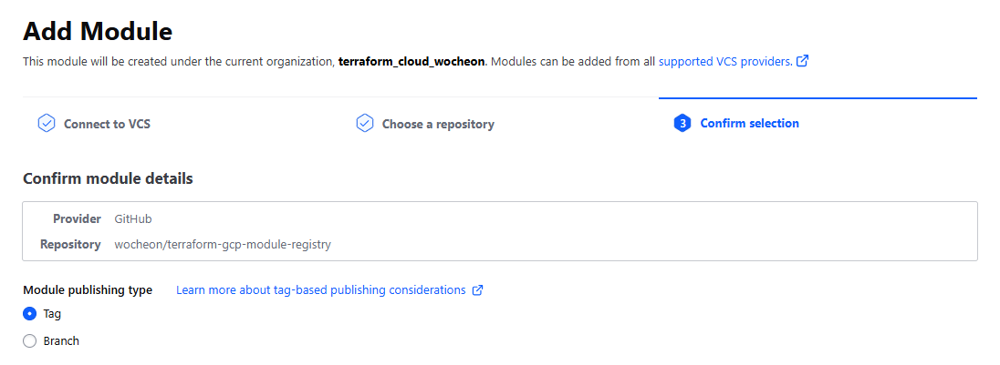
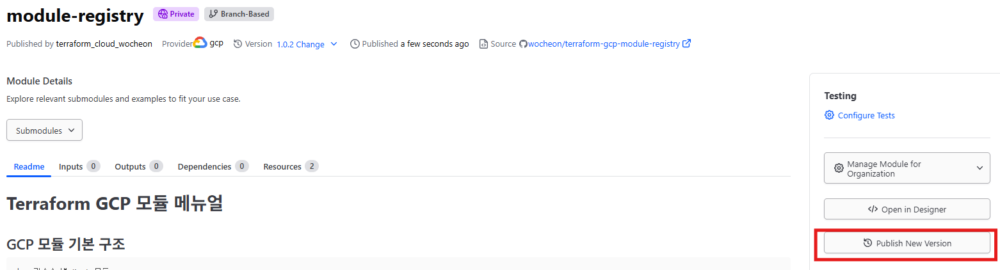
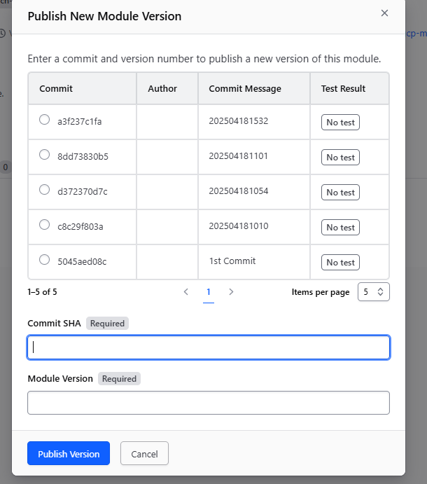

# Terraform Registry 

## Terraform Registry ?
- Terraform에서 사용하는 모듈과 프로바이더들을 공유하고 재사용할 수 있도록 해주는 공식 저장소(registry)기능
- 각 Provider가 공식으로 지원하는 모듈을 확인 및 사용가능 
    
- 모듈 구성을 통해 인프라 구성 시 편의성 증대    
    - 이미 검증된 모듈을 사용하여 빠르게 인프라를 구성가능 
    - 코드 재사용성 증가

- 기본 사용 형식
    - Registry 내 모듈 경로를 Source로 지정
    - 모듈 버전을 명시 하지 않는 경우 최신 버전을 가져오지만, 안정성을 위해 사용
    ```hcl
    module "vpc" {
    source  = "terraform-aws-modules/vpc/aws"
    version = "3.14.0"
    }
    ```

## Terraform Registry / Terraform Cloud Registry 간 차이점
- Terraform에서 지원하는 Registry는 Terraform Registry 와 Terraform Cloud Registry가 존재

- 공개 저장소를 사용하는 경우 Terraform Registry, 비공개 저장소가 필요한경우 Terraform Cloud Registry를 사용

- 주요 차이점 
    | 항목                        | Terraform Registry (Public)        | Terraform Cloud Registry (Private)           |
    |----------------------------|------------------------------------|---------------------------------------------|
    | 접근성                    | 누구나 사용 가능 (공개)             | 조직 내 사용자만 접근 가능 (비공개)         |
    | 배포 대상                | 전 세계 Terraform 사용자           | 특정 Terraform Cloud 조직 내 사용자         |
    | 모듈 업로드 방식           | GitHub 공개 저장소 연동 필요        | GitHub, GitLab 등과 연동, 비공개 가능        |
    | 권한 관리                 | 불가능                             | 조직/팀 단위로 모듈 접근 제어 가능           |


## Terraform Registry (Public) 

### 모듈 업로드를 위한 github repository 생성
- Terraform Registry와 연동을 위한 Repository 명칭 규칙
    - EX) AWS용 VPC 모듈 : terraform-aws-vpc
    - 규칙에 맞지않는 Repository는 인식 불가
```
terraform-<PROVIDER>-<NAME>
```
- 신규 Github Repository 구성 
    - Repository 명 : terraform-gcp-module-registry
    - 내부 구성
        - Submodule로 구성하여 모듈 추가를 용이하도록 구성
        - README 파일을 추가하여 메뉴얼 구성
    ```
    📦terraform-gcp-module-registry
    ┃ ┗ 📜README.md
    ┗ 📂modules
       ┗ 📂gce_disk
         ┣ 📜main.tf
         ┣ 📜output.tf
         ┗📜variables.tf
    ```
    - Terraform Reigstry에 업로드를 위해서는 최소 1개 이상의 tag가 필요
    ```sh
    # Git Commit&Push
    git init
    git add . 
    git branch -M main
    git commit -m "1st Commit"
    git push origin main

    # Git Add Tag 
    ## git log로 Commit_id 확인
    git log 

    ## tag 생성 - Commit을 지정하지 않으면 자동으로 최신 커밋을 통해 Push
    git tag v1.0.0 [commit_id]

    ## tag를 지정하여 Push
    git push origin v1.0.0
    ```
### Terrform registry에 모듈 업로드 

- Terraform Registry에 접속 및 로그인
    - https://registry.terraform.io/
        - github 연동을 통해 로그인

- 우측 상단 Publish > Moudle 선택

    

- 생성된 Registry를 선택 하여 배포
    
    

- 배포 완료 및 구성 확인
    - Github Repository 명의 <NAME> 부분이 모듈명으로 설정됨

    
    
- 수정 사항 반영 
    - Manage Module -> Resync Module

- 삭제 
    - 특정 버전만 삭제 
        - 버전 선택 후 Manage Module -> Delete Module Version
    - 전체 삭제 
        - 버전 선택 후 Manage Module -> Delete Module

### Terraform Registry의 모듈 사용
- 모듈 사용시 다음과 같이 Source를 지정 
    - Public Registry이므로 별도 인증절차 없이 사용가능
```
module "module-registry" {
  source  = "wocheon/module-registry/gcp"
  version = "1.0.0"
}
```

## Terraform Cloud Registry (Private)

- Terraform Cloud의 Registry를 구성하고 상에서 모듈을 업로드 하는 방법
- Private Registry이므로 해당 모듈을 불러오려면 API Token을 통해 인증이 필요함 
    - Terrafom Cloud의 API 토큰은 조직, 팀, 개인 단위로 생성이 가능 
    - 사용하는 토큰 권한 범위에 따라 모듈 사용가능 여부가 결정

### Module publishing type
- Terraform Cloud Registry는 두가지 방식의 모듈 배포 타입을 지원
    - Tag 기반
        - 기존 Terraform Registry와 동일하게 tag를 기준을 모듈의 버전을 나누는 방식
    - Branch 기반
        - 특정 브랜치의 Commit을 기준으로 버전 정보를 설정 가능 
        - EX) Main 브랜치의 1st_commit 을 1.0.0 버전으로 설정, 두번째 Commit을 1.0.1로 설정 
    
- Registry 모듈의 배포 타입은 언제든지 변경 가능 

### Terrafrom Cloud Registry 생성 

1. 연결할 Vesion Control Provider를 선택
    - 선택 가능 VCS
        - Github
        - Gitlab
        - Bitbucket
        - Azure DevOps

    - 기존 Repository를 사용할 예정이므로 github.com 선택
        - 선택 후 Github 로그인

        
<br>

2. Terraform Cloud <> Github Repository 간 연동 진행

    

<br>

3. 연동할 Git Repository를 목록에 추가 
    
    

<br>

4. 목록에 추가된 모듈 Repository 선택
        
    

<br>

5. 모듈 배포 타입 선택 후 생성
    - Tag를 생성해둔 상태이므로 Tag로 생성
    
    


### Terraform Cloud Registry 모듈 사용 방법

#### Terraform Cloud 에서 VCS 방식으로 사용 시 
- 기존과 동일하게 Source 및 버전 지정하여 사용
```
module "module-registry" {
  source  = "app.terraform.io/terraform_cloud_wocheon/module-registry/gcp"
  version = "1.0.1"
}
```

#### Terraform CLI에서 Terraform Cloud Registry 모듈 사용 
- VM, 기타 Shell 에서 terraform CLI를 통해 모듈을 사용하는 경우 API 토큰을 통한 인증이 필요 

- 인증 방법
    - `terraform login` 커맨드 실행
        - login 시 자동으로 ~/.credentials.tfrc.json 파일 생성
        - logout 시 파일 내용을 삭제

        ```bash
        $ terraform login
        Terraform will request an API token for app.terraform.io using your browser.
    
        If login is successful, Terraform will store the token in plain text in
        the following file for use by subsequent commands:
            /root/.terraform.d/credentials.tfrc.json
    
        Do you want to proceed?
          Only 'yes' will be accepted to confirm.
    
          Enter a value: yes
    
    
        ---------------------------------------------------------------------------------
        # API 토큰이 없는경우 해당 페이지 접속하여 Token 발급급
        Open the following URL to access the tokens page for app.terraform.io:
            https://app.terraform.io/app/settings/tokens?source=terraform-login
    
    
        ---------------------------------------------------------------------------------
    
        Generate a token using your browser, and copy-paste it into this prompt.
    
        Terraform will store the token in plain text in the following file
        for use by subsequent commands:
            /root/.terraform.d/credentials.tfrc.json
    
        # API 토큰 값 입력
        Token for app.terraform.io:
          Enter a value: 
    
    
        Retrieved token for user ciw0707
    
    
        ---------------------------------------------------------------------------------
    
                                                  -                                
                                                  -----                           -
                                                  ---------                      --
                                                  ---------  -                -----
                                                   ---------  ------        -------
                                                     -------  ---------  ----------
                                                        ----  ---------- ----------
                                                          --  ---------- ----------
           Welcome to HCP Terraform!                       -  ---------- -------
                                                              ---  ----- ---
           Documentation: terraform.io/docs/cloud             --------   -
                                                              ----------
                                                              ----------
                                                               ---------
                                                                   -----
                                                                       -
    
    
           New to HCP Terraform? Follow these steps to instantly apply an example configuration:
    
           $ git clone https://github.com/hashicorp/tfc-getting-started.git
           $ cd tfc-getting-started
           $ scripts/setup.sh
        ```

    - ~/.terraform.d/credentials.tfrc.json 파일 수동 생성

        >  ~/.terraform.d/credentials.tfrc.json
        ```hcl
        credentials "app.terraform.io" {
          # valid user API token
          token = "[API Token]"
        }
        ```

    - 모듈 Source 및 버전 지정 

    ```
    module "module-registry" {
      source  = "app.terraform.io/terraform_cloud_wocheon/module-registry/gcp"
      version = "1.0.0"
    }
    ```
    - `terraform init` 으로 제대로 모듈을 불러오는지 확인

### Terraform Cloud Registry의 모듈 버전 업데이트 
- Tag 기반
    - 모듈용 github Repository에 변경 사항 반영 및 Tag 추가
    - 신규 Tag 추가시 자동으로 버전 정보 업데이트 

- Branch 기반
    - Registry의 모듈 선택 > Publish New Version

        
    
    <br>

    - 새로운 버전으로 배포할 Commit 선택 및 버전 정보 입력하여 배포

        

### 모듈 삭제 및 Registry 삭제
- 모듈 선택 > Manage Module for Organization > Delete Module
    - Delete only this module version
        - 선택된 버전의 모듈만 삭제

    - Delete all versions for this provider for this module
        - 현재 Provicer 내의 모든 버전의 모듈 삭제

    - Delete all providers and versions for this module
        - 모든 Provicer 내의 모든 버전의 모듈 삭제 