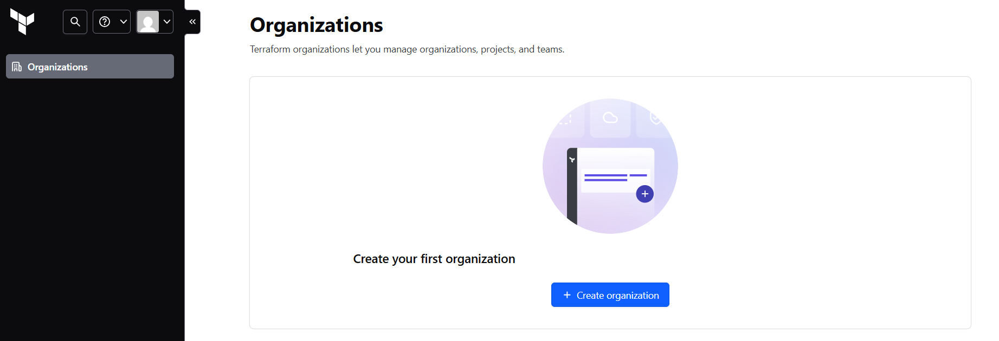
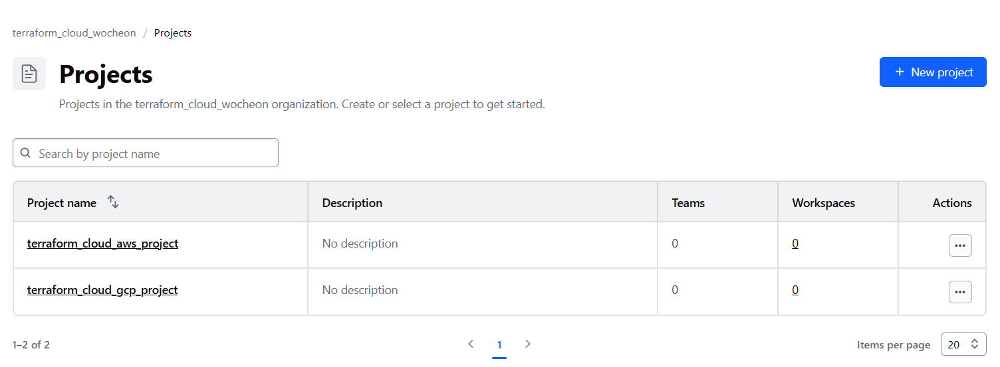

# Terraform Cloud 

## Terraform Cloud ? 

- HashiCorp에서 제공하는 Terraform의 관리형 SaaS 플랫폼
- Terraform CLI와 동일한 기능에 더해 팀 협업, 상태 관리, 버전 관리, 정책 제어, 실행 계획 승인 등의 기능을 제공
    - CLI를 사용하는 별도 환경이 없더라도 Terraform을 통해 리소스 배포 가능 
    - 각 리소스에 대한 버전 관리 가능

- Terraform Cloud를 사용하는 경우 상황에 따라 여러 Workflow들을 활용가능
    - EX) 
        - DEV : CLI-Driven → 빠른 테스트
        - PROD : VCS-Driven → Git PR + 승인 기반 배포
        - 공통 : API-Driven → CI/CD 연동으로 배포 자동화

### 참고. Terraform Workflows

| 워크플로 유형         | 실행 주체       | 실행 위치         | 대표 사용 예 | Git 연동 | Terraform Cloud 연동 |
|----------------------|----------------|-------------------|--------------|----------|----------------------|
| **CLI-Driven**       | 사용자 수동 실행 | 로컬 CLI (터미널) | 로컬 테스트, 단독 개발 | ❌ 선택적 | ✅ (선택) |
| **VCS-Driven**       | Git Push (자동) | Terraform Cloud   | 팀 협업, 자동 배포 | ✅ 필수 | ✅ 필수 |
| **API-Driven**       | API 호출, 스케줄러, 트리거 | Terraform Cloud   | CI/CD, 외부 시스템 통합 | ❌ | ✅ 필수 |

## Terraform Cloud 기본 세팅

### Terraform Cloud 계정 생성 및 인증

1. Terraform Cloud 페이지 접속
    - https://app.terraform.io

2. 계정 생성 후 메일 인증 수행

3. 인증완료 후 재접속하면 `organization` 페이지로 이동

### Terraform Cloud Organization 생성
- 신규 Organization 생성
    - Organization 명 : terraform_cloud_wocheon

### Terraform Cloud Project 생성
- Organization 생성 후, Projects를 확인해보면 Default Project 존재 
    - 해당 프로젝트는 자동생성되며 삭제 불가 
    - 명칭은 변경 가능하므로 필요시 변경 하여 사용  

- Project 구성
    - Default 프로젝트 명칭 변경 
        - Default Project -> terraform_cloud_gcp_project
    - 신규 프로젝트 생성
        - terraform_cloud_aws_project

## Public Cloud 접근을 위한 인증용 환경변수 등록 
- Terraform Cloud를 통해 Plan/Apply 시 Terraform Cloud 자체 호스팅 환경에서 plan/apply를 실행
    - 해당 호스팅 환경에서 Public Cloud 환경에 접근하도록 허용하려면 별도의 인증키를 등록 필요

- 권한 별 인증용 환경 변수 등록
    - Organization 단위의 환경 변수 등록
        - Setting -> Create organization variable 
        - 전체 Project/Workspace에서 허용하거나 특정 Project/Workspace에서만 사용가능하도록 허용 가능

    - Project 단위의 환경 변수 등록
        - Project 생성 후 Settings -> Create variable set
        - 전체 Workspace에서 허용하거나 특정 Workspace에서만 사용가능하도록 허용 가능

### GCP 인증 변수
- Service Account 키 등록 필요

- `GOOGLE_CREDENTIALS`
    - category : Environment variable
    - Key : GOOGLE_CREDENTIALS
    - Value : [GCP SA계정의 Key(.JSON)파일 내용 ]
        - *! 주의 한줄로 변경해서 입력해야 제대로 들어감*
    - Sensitive : TRUE

### AWS 인증 변수
- AWS_ACCESS_KEY_ID, AWS_SECRET_ACCESS_KEY 등록 필요 

- `AWS_ACCESS_KEY_ID`
    - category : Environment variable
    - Key : AWS_ACCESS_KEY_ID
    - Value : [AWS 계정의 ACCESS_KEY_ID]
    - Sensitive : TRUE

- `AWS_SECRET_ACCESS_KEY`
    - Key : AWS_SECRET_ACCESS_KEY
    - category : Environment variable
    - Value : [AWS 계정의 SECRET_ACCESS_KEY]
    - Sensitive : TRUE

## Terraform Cloud Workspace 생성 
- 생성된 프로젝트 내 실제 작업을 수행하는 workspace를 생성
    - Terraform 리소스에 대한 Plan/Apply를 수행 (RUN)
   
    - 각 Run 별로 실행기록을 보관하며 단계별 승인절차 사용 가능 
        - Plan and Apply (stanard) 진행방식
            - Plan 성공
            - 해당 Plan에 대한 승인여부 결정 
            - 승인시 Apply 진행 
            
    - 배포된 리소스의 State를 저장 및 관리

    - Lock을 통해 의도치 않은 중복 수정이나 충돌을 예방 가능
        - Lock은 각 workspace 단위로 수행됨
    

- 사용할 WorkFlow를 선택하여 WorkFlow별 작업공간 생성
    - Version Control Workflow
    - CLI-Driven Workflow
    - API-Driven Workflow
  
- 생성 완료된 Workspace의 설정은 언제든 변경 가능 

## Workspace 실행 모드 설정 
- Workspace 내에서  어떤 환경에서 Plan/Apply를 실행할 것인지를 설정 
    - VCS 연동 워크스페이스는 Remote Mode로만 사용 가능

- Workspace 생성 후 기본설정은 Remote

- 실행 모드 
    - Remote : Terraform Cloud의 호스팅 환경에서 Plan/Apply를 실행
    - Local : CLI를 실행하는 로컬 머신상에서 Plan/Apply를 실행
    - Agent : Agent를 통해 실행 ( Free Tier 사용 불가 )

- `실행모드를 변경하더라도 State 정보는 Work에 등록`

## 권한 구분
- Terrafrom Cloud의 경우 조직, 팀, 개인 단위로 권한 조정가능 
    - Free Tier에서는 모든 사용자가 Owner 팀 에 속하며 전체 권한을 가짐 ( 수정 불가)
    - Free Tier 사용 시 Owner 팀 외 별도 Team 추가 불가

- 조직 , 팀, 개인 단위의 API 토큰을 생성 가능